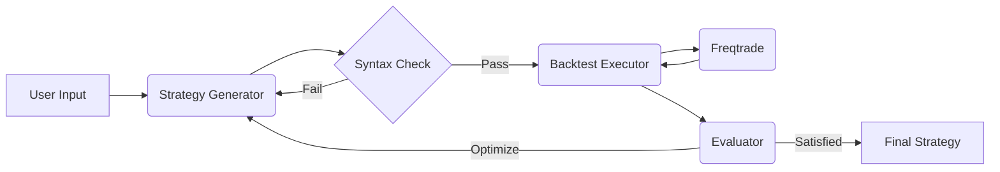

<div align="center">

<h1>StrategyAgent: AI-Driven Freqtrade Strategy Generator</h1>

<p>
  An autonomous agent system that generates, backtests, and optimizes crypto trading strategies for Freqtrade using Large Language Models (LLMs).
</p>

[English](README.md) | [中文](README_CN.md)

</div>

## 📖 Overview

StrategyAgent leverages **LangGraph** and **FastAPI** to create a closed-loop workflow for quantitative strategy development. It doesn't just write code; it verifies it, runs backtests using **Freqtrade**, analyzes the results, and iteratively improves the strategy until it meets performance criteria.

## 🚀 Features

- **Automated Strategy Generation**: Converts natural language ideas into valid `IStrategy` Python code.
- **Syntax Validation**: Ensures generated code is syntactically correct before execution.
- **Autonomous Backtesting**: Automatically triggers Freqtrade backtests via MCP (Model Context Protocol) tools.
- **Iterative Optimization**: Analyzes backtest metrics (Sharpe ratio, Profit, Drawdown) to refine and improve strategies.
- **Interactive UI**: Streamlit-based frontend for easy interaction and visualization.

## 🏗 Architecture



- **Backend**: FastAPI, LangGraph, LangChain
- **Frontend**: Streamlit
- **Trading Engine**: Freqtrade

## 📦 Installation

1. **Clone the repository**
   ```bash
   git clone https://github.com/your-repo/StrategyAgent.git
   cd StrategyAgent
   ```

2. **Create a Virtual Environment**
   ```bash
   conda create -n strategy_agent python=3.10
   conda activate strategy_agent
   ```

3. **Install Dependencies**
   ```bash
   pip install -r requirements.txt
   ```

4. **Setup Freqtrade**
   Ensure you have `freqtrade` installed or available in your environment.
   ```bash
   pip install freqtrade
   ```
   *Note: You need to initialize Freqtrade user data directory in `StrategyAgent/freqtrade_worker` if not present.*

5. **Configure Environment**
   Create a `.env` file in the `StrategyAgent/backend` directory (or root):
   ```env
   OPENAI_API_KEY=your_api_key_here
   ```

## 🎬 Usage

### 1. Start the Backend
Run the FastAPI server from the project root:
```bash
uvicorn StrategyAgent.backend.app.app:app --reload
```
The API will be available at `http://127.0.0.1:8000`.

### 2. Start the Frontend
In a new terminal, run the Streamlit app:
```bash
streamlit run StrategyAgent/frontend/app.py
```
The UI will open at `http://localhost:8501`.

### 3. Generate a Strategy
- Open the Web UI.
- Enter a strategy idea (e.g., "RSI and Bollinger Bands strategy").
- Set max iterations.
- Click **Generate**.

## ⚠️ Disclaimer

This software is for **educational and research purposes only**. Do not use it for live trading without extensive testing. The authors are not responsible for any financial losses.

