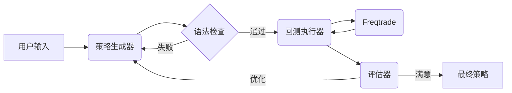

<div align="center">

<h1>StrategyAgent: AI 驱动的 Freqtrade 策略生成器</h1>

<p>
  一个自主智能体系统，利用大语言模型 (LLMs) 为 Freqtrade 生成、回测并优化加密货币交易策略。
</p>

[English](README_EN.md) | [中文](README.md)

</div>

## 📖 简介

StrategyAgent 利用 **LangGraph** and **FastAPI** 构建了一个量化策略开发的闭环工作流。它不仅能编写代码，还能进行语法验证，调用 **Freqtrade** 进行回测，分析结果，并根据表现迭代优化策略，直到满足要求。

## 🚀 功能特性

- **自动策略生成**: 将自然语言想法转化为有效的 `IStrategy` Python 代码。
- **语法验证**: 在执行前确保生成的代码符合语法规则。
- **自主回测**: 通过 MCP (模型上下文协议) 工具自动触发 Freqtrade 回测。
- **迭代优化**: 分析回测指标（夏普比率、利润、回撤）以改进和完善策略。
- **交互式 UI**: 基于 Streamlit 的前端界面，便于交互和可视化。

## 🏗 架构



- **后端**: FastAPI, LangGraph, LangChain
- **前端**: Streamlit
- **交易引擎**: Freqtrade

## 📦 安装

1. **克隆仓库**
   ```bash
   git clone https://github.com/your-repo/StrategyAgent.git
   cd StrategyAgent
   ```

2. **创建虚拟环境**
   ```bash
   conda create -n strategy_agent python=3.10
   conda activate strategy_agent
   ```

3. **安装依赖**
   ```bash
   pip install -r requirements.txt
   ```

4. **设置 Freqtrade**
   确保您的环境中已安装 `freqtrade`。
   ```bash
   pip install freqtrade
   ```

5. **下载历史数据**
   在运行策略生成前，需要下载交易数据：
   ```bash
   cd freqtrade_worker
   freqtrade download-data --config user_data/config.json --timerange 20230101-20231231 --timeframe 1h --pairs BTC/USDT ETH/USDT
   ```
   详细说明请参考 `freqtrade_worker/README.md`。

6. **配置环境**
   在项目根目录创建 `.env` 文件（参考 `env.example`）：
   ```env
   # LLM 提供商配置
   LLM_PROVIDER=doubao
   DOUBAO_API_KEY=your_api_key_here
   
   # 或使用 OpenAI
   # LLM_PROVIDER=openai
   # OPENAI_API_KEY=your_api_key_here
   ```

7. **（可选）配置 LangSmith**
   LangSmith 用于监控和调试 Agent 的运行过程：
   ```bash
   # 运行配置检查脚本
   .\check_langsmith.bat
   ```
   
   在 `.env` 文件中添加：
   ```env
   LANGCHAIN_TRACING_V2=true
   LANGCHAIN_API_KEY=your_langsmith_api_key
   LANGCHAIN_PROJECT=StrategyAgent
   ```
   
   详细配置指南：[files/LANGSMITH_SETUP_GUIDE.md](files/LANGSMITH_SETUP_GUIDE.md)

## 🎬 使用方法

### 方式一：一键启动（推荐）
Windows 用户可以直接双击或运行：
```bash
.\run_agent.bat
```
这将同时启动后端和前端服务。

### 方式二：手动启动
如果需要分别启动服务：

**1. 启动后端**
```bash
uvicorn backend.app.app:app --host 127.0.0.1 --port 8000 --reload
```
API 地址: `http://127.0.0.1:8000`

**2. 启动前端**
```bash
streamlit run frontend/app.py --server.port 8501
```
Web UI 地址: `http://localhost:8501`

### 生成策略
1. 打开浏览器访问 `http://localhost:8501`
2. 输入策略想法（例如："基于 RSI 和布林带的策略，RSI<30时买入，RSI>70时卖出"）
3. 设置最大迭代次数（建议 3-5 次）
4. 点击 **生成策略** 按钮
5. 等待 AI 生成、回测并优化策略（可能需要几分钟）
6. 查看生成的代码、回测结果和日志

## ⚠️ 免责声明

本软件仅供**教育和研究目的**使用。在未经过充分测试的情况下，请勿用于实盘交易。作者不对任何财务损失负责。
