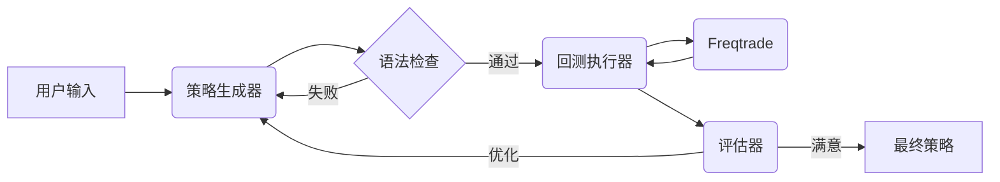

<div align="center">

<h1>StrategyAgent: AI 驱动的 Freqtrade 策略生成器</h1>

<p>
  一个自主智能体系统，利用大语言模型 (LLMs) 为 Freqtrade 生成、回测并优化加密货币交易策略。
</p>

[English](README.md) | [中文](README_CN.md)

</div>

## 📖 简介

StrategyAgent 利用 **LangGraph** 和 **FastAPI** 构建了一个量化策略开发的闭环工作流。它不仅能编写代码，还能进行语法验证，调用 **Freqtrade** 进行回测，分析结果，并根据表现迭代优化策略，直到满足要求。

## 🚀 功能特性

- **自动策略生成**: 将自然语言想法转化为有效的 `IStrategy` Python 代码。
- **语法验证**: 在执行前确保生成的代码符合语法规则。
- **自主回测**: 通过 MCP (模型上下文协议) 工具自动触发 Freqtrade 回测。
- **迭代优化**: 分析回测指标（夏普比率、利润、回撤）以改进和完善策略。
- **交互式 UI**: 基于 Streamlit 的前端界面，便于交互和可视化。

## 🏗 架构



- **后端**: FastAPI, LangGraph, LangChain
- **前端**: Streamlit
- **交易引擎**: Freqtrade

## 📦 安装

1. **克隆仓库**
   ```bash
   git clone https://github.com/your-repo/StrategyAgent.git
   cd StrategyAgent
   ```

2. **创建虚拟环境**
   ```bash
   conda create -n strategy_agent python=3.10
   conda activate strategy_agent
   ```

3. **安装依赖**
   ```bash
   pip install -r requirements.txt
   ```

4. **设置 Freqtrade**
   确保您的环境中已安装 `freqtrade`。
   ```bash
   pip install freqtrade
   ```
   *注意：如果尚未存在，您可能需要初始化 `StrategyAgent/freqtrade_worker` 目录。*

5. **配置环境**
   在 `StrategyAgent/backend` 或项目根目录创建 `.env` 文件：
   ```env
   OPENAI_API_KEY=your_api_key_here
   ```

## 🎬 使用方法

### 1. 启动后端
在项目根目录下运行 FastAPI 服务：
```bash
uvicorn StrategyAgent.backend.app.app:app --reload
```
API 地址: `http://127.0.0.1:8000`。

### 2. 启动前端
在新的终端中运行 Streamlit 应用：
```bash
streamlit run StrategyAgent/frontend/app.py
```
Web UI 地址: `http://localhost:8501`。

### 3. 生成策略
- 打开 Web 界面。
- 输入策略想法（例如：“基于 RSI 和布林带的策略”）。
- 设置最大迭代次数。
- 点击 **生成策略**。

## ⚠️ 免责声明

本软件仅供**教育和研究目的**使用。在未经过充分测试的情况下，请勿用于实盘交易。作者不对任何财务损失负责。

