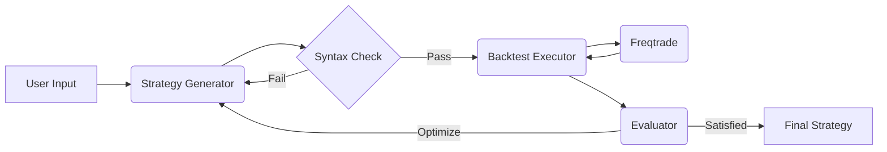

<div align="center">

<h1>StrategyAgent: AI-Driven Freqtrade Strategy Generator</h1>

<p>
  An autonomous agent system that generates, backtests, and optimizes crypto trading strategies for Freqtrade using Large Language Models (LLMs).
</p>

[English](README_EN.md) | [中文](README.md)

</div>

## 📖 Overview

StrategyAgent leverages **LangGraph** and **FastAPI** to create a closed-loop workflow for quantitative strategy development. It doesn't just write code; it verifies it, runs backtests using **Freqtrade**, analyzes the results, and iteratively improves the strategy until it meets performance criteria.

## 🚀 Features

- **Automated Strategy Generation**: Converts natural language ideas into valid `IStrategy` Python code.
- **Syntax Validation**: Ensures generated code is syntactically correct before execution.
- **Autonomous Backtesting**: Automatically triggers Freqtrade backtests via MCP (Model Context Protocol) tools.
- **Iterative Optimization**: Analyzes backtest metrics (Sharpe ratio, Profit, Drawdown) to refine and improve strategies.
- **Interactive UI**: Streamlit-based frontend for easy interaction and visualization.

## 🏗 Architecture



- **Backend**: FastAPI, LangGraph, LangChain
- **Frontend**: Streamlit
- **Trading Engine**: Freqtrade

## 📦 Installation

1. **Clone the repository**
   ```bash
   git clone https://github.com/your-repo/StrategyAgent.git
   cd StrategyAgent
   ```

2. **Create a Virtual Environment**
   ```bash
   conda create -n strategy_agent python=3.10
   conda activate strategy_agent
   ```

3. **Install Dependencies**
   ```bash
   pip install -r requirements.txt
   ```

4. **Setup Freqtrade**
   Ensure you have `freqtrade` installed in your environment.
   ```bash
   pip install freqtrade
   ```

5. **Download Historical Data**
   Before generating strategies, download trading data:
   ```bash
   cd freqtrade_worker
   freqtrade download-data --config user_data/config.json --timerange 20230101-20231231 --timeframe 1h --pairs BTC/USDT ETH/USDT
   ```
   See `freqtrade_worker/README.md` for more details.

6. **Configure Environment**
   Create a `.env` file in the project root (refer to `env.example`):
   ```env
   OPENAI_API_KEY=your_api_key_here
   ```

## 🎬 Usage

### Option 1: One-Click Launch (Recommended)
Windows users can simply run:
```bash
.\run_agent.bat
```
This will start both backend and frontend services.

### Option 2: Manual Launch
If you prefer to start services separately:

**1. Start the Backend**
```bash
uvicorn backend.app.app:app --host 127.0.0.1 --port 8000 --reload
```
The API will be available at `http://127.0.0.1:8000`

**2. Start the Frontend**
```bash
streamlit run frontend/app.py --server.port 8501
```
The UI will open at `http://localhost:8501`

### Generate a Strategy
1. Open your browser and navigate to `http://localhost:8501`
2. Enter a strategy idea (e.g., "RSI and Bollinger Bands strategy, buy when RSI<30, sell when RSI>70")
3. Set max iterations (3-5 recommended)
4. Click the **Generate Strategy** button
5. Wait for the AI to generate, backtest, and optimize the strategy (may take a few minutes)
6. Review the generated code, backtest results, and logs

## ⚠️ Disclaimer

This software is for **educational and research purposes only**. Do not use it for live trading without extensive testing. The authors are not responsible for any financial losses.

